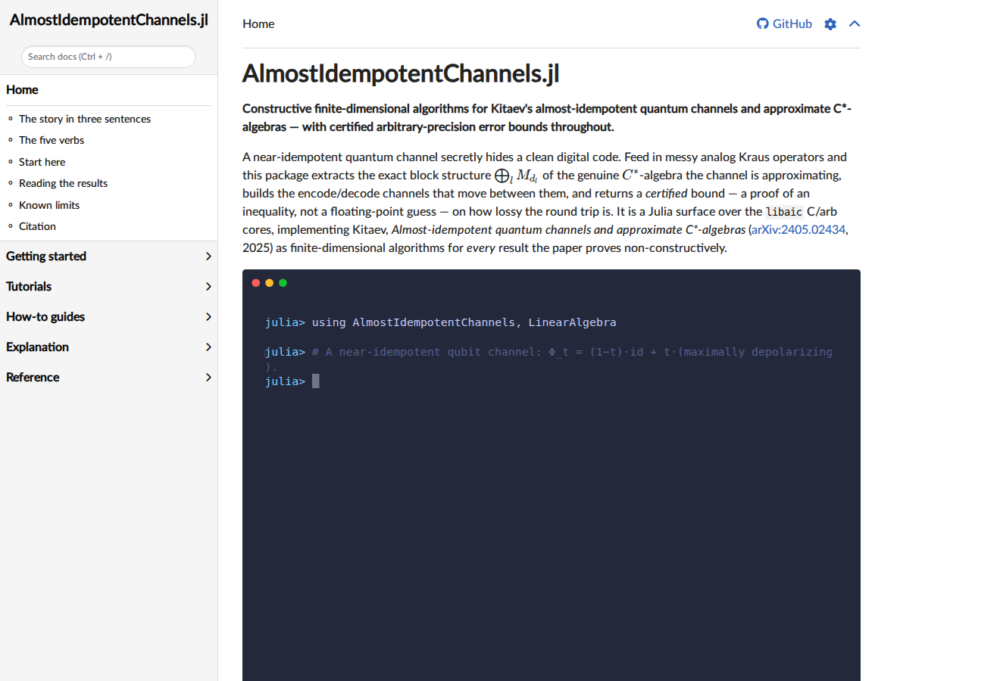
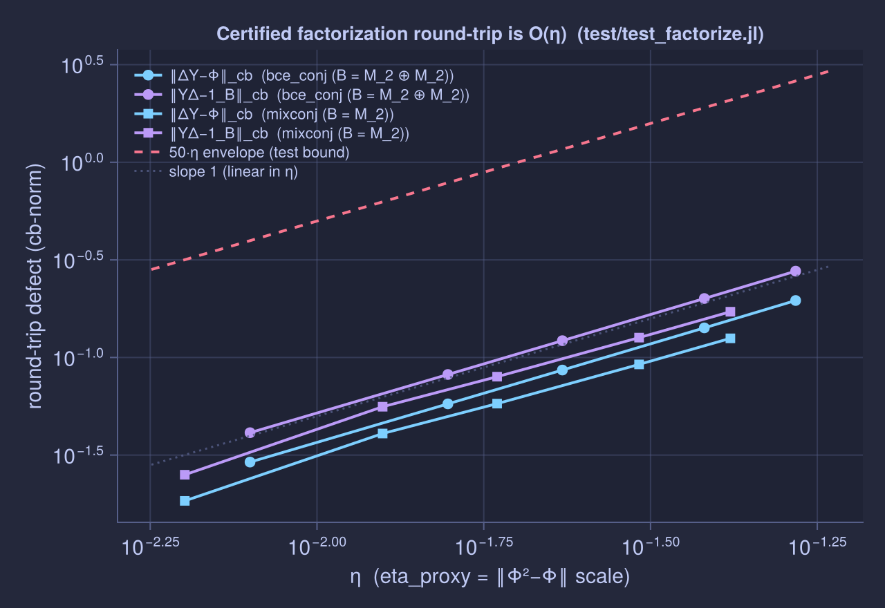
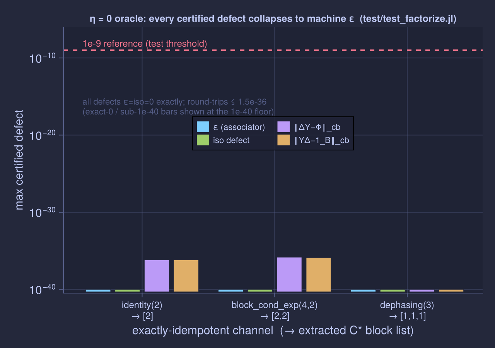

# AlmostIdempotentChannels.jl

[](LICENSE)
[](https://julialang.org/)
[](https://arxiv.org/abs/2405.02434)

**Constructive finite-dimensional algorithms for Kitaev's almost-idempotent
quantum channels and approximate C\*-algebras — with certified arbitrary-precision
error bounds throughout.**

A near-idempotent quantum channel secretly hides a clean digital code. Feed in
messy analog Kraus operators and this package extracts the exact block structure
`⊕_l M_{d_l}` of the genuine C\*-algebra the channel is approximating, builds the
encode/decode channels that move between them, and returns a *certified* bound —
a proof of an inequality, not a floating-point guess — on how lossy the round trip
is. It is a Julia surface over the `libaic` C/arb cores, implementing
[Kitaev, *Almost-idempotent quantum channels and approximate C\*-algebras*,
arXiv:2405.02434](https://arxiv.org/abs/2405.02434) (2025) as finite-dimensional
algorithms for *every* result the paper establishes non-explicitly.


## Why this exists

**The object.** A unital completely positive (UCP) map `Φ` on `B(H)`, `dim H = n`,
in the Heisenberg (observable) picture `Φ(X) = Σ_a K_a† X K_a`. This is the most
general noisy, information-preserving measurement of observables you can write
down. `Φ` is **η-idempotent** when `‖Φ² − Φ‖_cb ≤ η`, the completely-bounded
norm — a supremum over all ampliations `1 ⊗ Φ`, not the bare operator norm. `η`
measures how close `Φ` is to a genuine projection onto a stable subalgebra of
observables; `η = 0` exactly when `Φ` is a conditional expectation onto a
C\*-subalgebra.

**What Kitaev proved, and why it is surprising.** An η-idempotent `Φ` does not
merely *almost* project. Its image carries the structure of an **ε-C\*-algebra**
`A = Img Φ̃` with `ε = O(η)`: a vector space satisfying the C\*-axioms only *up
to* ε, with the Choi–Effros product `X ⋆ Y = Φ̃(XY)` and no exact unit. The
headline rigidity theorem (`th_main`, arXiv:2405.02434 §2) is that **every
finite-dimensional ε-C\*-algebra is O(ε)-isomorphic to a *genuine* C\*-algebra
`B = ⊕_l M_{d_l}`, with a universal, dimension-independent constant.** The
constant does not grow with `n` — and the naive averaging route fails precisely
because *its* constant grows like `n` (§9). When `A` comes from a finite-dimensional
`Φ`, that isomorphism and its inverse are realised by quantum channels, giving an
**approximate factorization `Φ ≈ Δ Υ`** of the channel through `B`: a decode map
`Δ` and an encode map `Υ` with `ΔΥ ≈ Φ̃` and `ΥΔ ≈ 1_B`.

**What this package contributes.** Kitaev's proofs are *non-explicit*: they show
the objects exist without exhibiting them. A nontrivial projection is conjured by
the Lefschetz–Hopf fixed-point theorem — a topological count of fixed points, no
witness; the functional calculus and the trivialising Haar-measure diagonal are
written as contour integrals and group averages — explicit, but infinite-dimensional
and analytic. None of them hands you the object. The obstruction is non-explicit
existence and infinite-dimensional phrasing, *not* the axiom of choice — in finite
dimensions every one of those objects is computable, and this package gives an
explicit, terminating, error-certified algorithm for each, wrapped as five verbs
that read like the paper:

1. The whole pipeline is **constructive and finite-dimensional** — no existence
   proof is left as an existence proof.
2. Every defect comes back as a **`CertifiedBracket`** `lo ≤ x ≤ hi`: FLINT/arb
   error balls rounded *outward* so the bound survives the conversion to `double`.
   The output is a proof of the same inequality the theorem promises.
3. It is **solver-free by default.** The rigorous η bracket and the entire
   factorization run on the eig-free arb certifier with no SDP solver installed.
   MOSEK is an optional extension, only for the exact value and the tight bracket.

## The headline pipeline

```julia
using AlmostIdempotentChannels, LinearAlgebra

# A near-idempotent qubit channel: Φ_t = (1−t)·id + t·(maximally depolarizing).
Φ = UCPMap(phit_kraus(2, 0.1))

η = certified_defect(Φ)        # rigorous ‖Φ²−Φ‖_cb bracket — NO solver
A = associated_algebra(Φ)      # the ε-C* algebra A = Img Φ̃
v = main_isomorphism(Φ)        # the O(ε)-isomorphism v: B → A, dim-independent constant
F = factorize(Φ)               # Φ ≈ Δ Υ through a genuine C* algebra B = ⊕_l M_{d_l}
```

`phit_kraus`, `bce_conj_kraus`, `block_cond_exp_kraus` below are the test fixtures
(`test/fixtures.jl`); `Φ_t = (1−t)·id + t·Dep_d` has the closed-form defect
`‖Φ_t²−Φ_t‖_⋄ = t(1−t)·2(1−1/d²)`, so the certified bracket can be checked against
an analytic value.

## Features

Each row is a theorem of the paper made executable, and a rigorous certificate of
its bound. The verbs escalate from the cheapest scalar to the full factorization.

| Result (arXiv:2405.02434) | Verb / type | Certified by |
|---|---|---|
| **Idempotency defect** `η = ‖Φ²−Φ‖_cb` (§1) | `certified_defect(Φ)` → `CertifiedBracket` | eig-free arb bracket, outward-rounded; solver-free |
| **`prop_P` regularisation** `Φ̃ = θ(2Φ−1)` (§3) | `associated_algebra(Φ)` → `EpsCStarAlgebra` | certified ε associator-defect bracket |
| **`th_main` isomorphism** `v: B → A`, O(ε), dim-independent (§2/§9) | `main_isomorphism(Φ)` → `MainIsomorphism` | certified `‖v‖_cb`, `‖v⁻¹‖_cb`, isodefect brackets |
| **`th_idemp_structure`** the genuine `B = ⊕_l M_{d_l}` (§11) | `algebra(F)` → `CStarAlgebra` | exact block sizes from the Wedderburn structure |
| **`th_factorization`** `Φ ≈ Δ Υ` (§12) | `factorize(Φ)` → `ChannelFactorization` | two certified round-trip brackets `‖ΔΥ−Φ‖_cb`, `‖ΥΔ−1_B‖_cb` |
| **Encode / decode channels** `Υ*`, `Δ*` (§1, §12) | `encode(F)`, `decode(F)` → `CPMap` | CPTP duals; round-trip brackets are the certificate |
| **Exact diamond-norm value** (Watrous SDP) | `idempotency_defect(Φ)` → `Float64` | MOSEK extension; strong-duality cross-check |
| **Tight rigorous bracket** | `certified_defect(Φ; tight=true)` | arb certifier fed MOSEK feasible points |

## Install and quick start

Dependencies for the C core: a C11 compiler, CMake ≥ 3.24, `libflint-dev`
(FLINT ≥ 3.0, which brings arb), `liblapacke-dev`/`liblapack-dev`/`libblas-dev`.
Tested on Debian/Ubuntu Linux with Julia 1.10+.

```sh
# 1. Build the C/arb core (produces build/libaic.so).
sudo apt install build-essential cmake libflint-dev liblapacke-dev liblapack-dev libblas-dev
cmake -S . -B build && cmake --build build

# 2. Point the package at the library (writes LocalPreferences.toml; no Pkg.build).
julia --project=julia/AlmostIdempotentChannels.jl -e '
    using AlmostIdempotentChannels
    set_libaic_path!(joinpath(pwd(), "build", "libaic.so"))'   # then restart Julia

# 3. Run the solver-free test suite (green with no MOSEK installed).
julia --project=julia/AlmostIdempotentChannels.jl -e 'using Pkg; Pkg.test()'
```

Library discovery is via `Preferences` — there is no `deps/build.jl` and no
`Pkg.build()` step. The default looks for `build/libaic.so` next to the package;
`set_libaic_path!(p)` points it anywhere else. The suite is green with no solver
installed: `AlmostIdempotentChannels | 219 219 PASS` in ~2m09s.

## Documentation

The full documentation is a [Diátaxis](https://diataxis.fr)-structured site —
tutorials, how-to guides, explanation essays, and a complete API reference. It is
plain Markdown with relative links, so you can **read and navigate all of it on
GitHub** without building anything: **start at
[`docs/src/index.md`](docs/src/index.md)**.

- **Learn** — [the five-verb pipeline](docs/src/tutorials/pipeline.md) ·
  [the η = 0 oracle](docs/src/tutorials/eta0_oracle.md) ·
  [multi-block channels](docs/src/tutorials/multiblock.md)
- **Do** — [certify a defect](docs/src/howto/certify_defect.md) ·
  [factorize a channel](docs/src/howto/factorize.md) ·
  [interpret a `CertifiedBracket`](docs/src/howto/read_bracket.md) ·
  [extract the block structure](docs/src/howto/block_structure.md)
- **Understand** — [the mathematics](docs/src/explanation/math_story.md) ·
  [certified arithmetic & the cross-check ladder](docs/src/explanation/certified_arithmetic.md) ·
  [dimension-independence](docs/src/explanation/dim_independence.md) ·
  [design decisions & known limits](docs/src/explanation/design_limits.md)
- **Look up** — [API reference](docs/src/reference/api.md) ·
  [notation glossary](docs/src/reference/notation.md)

To build the rendered HTML site (every example executes against `libaic`; there is
no hosted site by design):

```sh
julia --project=docs -e 'using Pkg; Pkg.instantiate(); include("docs/make.jl")'
# -> open docs/build/index.html
```

<p align="center">
  
  <br/>
  <em>The rendered site (build it locally, or browse the Markdown on GitHub).</em>
</p>

## A look at it running

Each plot below re-renders a passing test; the reproduce script for each is in
`docs/plots/` (a separate plotting environment, not a package dependency).

**The certified bracket contains the truth.** For `Φ_t` the defect has a closed
form; the solver-free eig-free bracket `[lo, hi]` brackets it for every input.
Containment is a test invariant (`test/test_core.jl`), so this plot is a passing
test drawn.

<p align="center">
  
  <br/>
  <em>The eig-free certificate [lo, hi] (shaded band) brackets the analytic
  η = t(1−t)·2(1−1/d²) (line) for every t. Loose by design (hi/lo ≈ 2n): it
  certifies a value rather than computing it.</em>
</p>

**Dimension-independence — the paper's central claim, verified.** The `th_main`
isomorphism constant `c = isodefect/η` over a block-algebra family of growing
dimension is *flat*: it does not grow with `dim A`. The naive averaging route the
paper warns against (§9) has a constant that grows like `n`; this one does not.

<p align="center">
  
  <br/>
  <em>c = isodefect/η over dim A ∈ {8,12,16,18,20} (the C dim-sweep, tests/test_dbo3.c,
  prec=256): OLS slope −2.7e-4, max c = 0.047 at dim A = 12. The constant does not
  grow with dimension (approximate_algebras.tex:484).</em>
</p>

**The factorization round-trip is O(η).** For genuinely oblique, multi-block
channels (`bce_conj`, `B = M_2 ⊕ M_2`) the certified round-trip defects
`‖ΔΥ−Φ‖_cb` and `‖ΥΔ−1_B‖_cb` scale *linearly* in η, well below the generous
`50·η` envelope the tests assert.

<p align="center">
  
  <br/>
  <em>Certified round-trip defects ‖ΔΥ−Φ‖_cb and ‖ΥΔ−1_B‖_cb vs η for oblique
  multi-block channels. Linear in η, below the 50·η envelope (test/test_factorize.jl).</em>
</p>

**The η = 0 oracle collapses to machine ε.** When `Φ` is exactly a conditional
expectation, every defect — the associator ε, both round-trip brackets, the
isomorphism defect — collapses below `1e-9`, and the extracted block structure is
exactly right: `identity(2) → [2]`, `block_cond_exp(4,2) → [2,2]`,
`dephasing(3) → [1,1,1]`. This is the cleanest ground truth in the paper.

<p align="center">
  
  <br/>
  <em>On exactly-idempotent channels every certified defect collapses below 1e-9 and
  the block structure is exact. The cleanest cross-check rung (test/test_factorize.jl).</em>
</p>

## Rigour and the cross-check ladder

The paper's whole subject is rigorous O(ε) bounds, so this package certifies them
numerically rather than trusting `double`. Every scalar result is a
`CertifiedBracket` `lo ≤ x ≤ hi` built from FLINT/arb error balls rounded outward
(FLOOR/CEIL) so the bound is still rigorous after the `double` conversion. The
cross-check ladder, weakest to strongest:

1. **double vs arb at prec = 53** — the same routine on both number paths agrees
   to ~1e-10 (the C/arb Choi of `Φ²−Φ` matches the pure-Julia one, `test_core.jl`).
2. **certified containment** — the bracket provably contains the closed-form η for
   the `Φ_t` family at every `t` (`test_core.jl`).
3. **the η = 0 oracle** — exactly-idempotent `Φ` ⇒ every defect < 1e-9, exact
   blocks (`test_factorize.jl`). Zero defect is the unambiguous ground truth;
   measured maxima are `4.4e-75` (`‖ΔΥ−Φ‖_cb`) and `3.9e-75` (`‖ΥΔ−1_B‖_cb`).
4. **strong duality (MOSEK)** — the Watrous primal and dual diamond-norm values
   agree with each other and with the analytic anchor to 1e-6 (`test_sdp.jl`,
   measured max primal-dual gap 1.23e-11), pinning the dual normalisation.

## Benchmarks

Plain-text tables; concrete numbers throughout.

```
Dimension-independence of the th_main constant c = isodefect/η
  (block family ⊕_j M_d, dim A = k·d²; from the C dim-sweep, tests/test_dbo3.c, prec=256)

  dim A |  k |  d |  c = isodefect/η
  ------+----+----+------------------
      8 |  2 |  2 |  0.0182
     12 |  3 |  2 |  0.0470     <- worst case (largest c)
     16 |  4 |  2 |  0.0247
     18 |  2 |  3 |  0.0410
     20 |  5 |  2 |  0.0134

  OLS slope = -2.7e-4;  max c = 0.047 << 1;  no growth with dim A (tex:484 holds).
```

```
Tight (MOSEK) vs eig-free (solver-free) bracket width on ‖Φ²−Φ‖_cb
  (the eig-free bracket is loose by design, hi/lo ~ 2n; the tight one is fed the
   Watrous SDP feasible points)

  fixture        |  eig-free width  |  tight width
  ---------------+------------------+--------------
  phit(2, 0.3)   |  5.46e-01        |  5.76e-13
  phit(2, 0.1)   |  2.34e-01        |  1.60e-13
  paper(0.1)     |  2.01e-01        |  4.60e-14

  The tight certifier widths are ~1e-13/1e-14, ~10^12x tighter than eig-free;
  width(tight) < width(loose) is a test invariant (test/test_sdp.jl).
```

## Known limits

Stated plainly (the bead IDs are the project's issue tracker).

- **`factorize` has a tighter domain than the rest of the pipeline.** It builds
  `Υ` via a power-series functional calculus whose convergence domain is much
  smaller than the `prop_P` basin `ρ(Φ²−Φ) < 1/4` (bug `aic-exa.13`). The verb
  pre-checks a conservative `ρ < 0.10` in Julia and throws a clean `ArgumentError`
  — it does **not** abort the session. `associated_algebra` and `main_isomorphism`
  keep the wider `ρ < 1/4` domain; `certified_defect` is always safe at any η.
- **The `decode` channel is only O(η)-trace-preserving for η > 0.** Its underlying
  observable map is only O(η)-completely-positive, so the internal Choi→Kraus
  PSD-cone projection clips a small negative mass (measured clipped mass ≈ 3.7e-6
  on multi-block oblique fixtures); `iscptp(decode(F))` is `false` at the default
  `atol = 1e-9` and `true` at `atol = 1e-4`. The rigorous certificate is the
  cb-norm round-trip bracket, not `iscptp` at machine tolerance. The encode channel
  and the η = 0 oracle decode are TP to machine precision.
- **The eig-free bracket is loose by design** (`hi/lo ~ 2n`). It certifies a value
  rather than competing with the solver. For a tight bracket or the exact value,
  use the MOSEK extension.

## Design philosophy

- **C + FLINT + Julia, not pure Julia.** The numerical cores are tight C with two
  number paths — a fast `double`/LAPACK path that anchors the test suite, and a
  FLINT/arb path that produces the certified balls. Julia is the `ccall` surface.
- **arb, not floating point.** The paper certifies rigorous bounds; arb lets the
  code certify the same bounds numerically rather than trusting `double`. The
  double path is what keeps the tests fast; the arb path is what makes the output
  a proof.
- **Constructive, not existence.** Every result is implemented as a finite-
  dimensional algorithm that produces the object the paper merely asserts to
  exist, meeting the bound the theorem promises.

## The MOSEK extension (optional)

The core is green with no solver. Installing `Convex` + `Mosek` + `MosekTools`
activates `AICMosekExt`, which adds two things: the exact diamond-norm value
`idempotency_defect(Φ)` (the Watrous SDP), and the *tight* rigorous bracket
`certified_defect(Φ; tight=true)` — the arb certifier fed the SDP feasible points,
so the bracket width collapses from `~2n` to `~(solver tol + arb radius) ≈ 1e-13`.
Without the solver, both entry points throw a helpful install hint rather than a
`MethodError`. MOSEK requires a license.

```julia
using AlmostIdempotentChannels, Convex, Mosek, MosekTools
Φ = UCPMap(phit_kraus(2, 0.3))
idempotency_defect(Φ)              # exact: 0.3149999999994273 (= 0.3·0.7·1.5)
certified_defect(Φ; tight=true)    # rigorous bracket, width ~5.8e-13, carries the SDP value
```

<details>
<summary><b>Math primer: η-idempotence → ε-C\*-algebra → genuine C\* → factorization (click to expand)</b></summary>

The whole story is three approximate inequalities and one rigidity theorem.

**1. η-idempotence (the input).** `Φ: B(H) → B(H)` is UCP and

> `‖Φ² − Φ‖_cb ≤ η`   (arXiv:2405.02434, §1)

in the completely-bounded (= diamond) norm, the supremum over all ampliations
`1 ⊗ Φ`. At `η = 0`, `Φ` is exactly a conditional expectation onto a C\*-subalgebra.

**2. The ε-C\*-algebra (the structure).** Set `Φ̃ = θ(2Φ−1)`, the exact-idempotent
regularisation (`prop_P`, §3), valid in the spectral basin `ρ(Φ²−Φ) < 1/4`. Its
image `A = Img Φ̃` is an *oblique* subspace of `M_n` carrying the Choi–Effros
product `X ⋆ Y = Φ̃(XY)`. The C\*-axioms hold only up to `ε = O(η)`:

> `‖(X⋆Y)⋆Z − X⋆(Y⋆Z)‖ ≤ ε·‖X‖‖Y‖‖Z‖`,  and the C\*-identity and unit laws up to ε  (§2)

There is no exact unit; associativity is approximate. Do not assume otherwise.

**3. The genuine C\*-algebra (the rigidity).** The main theorem:

> every finite-dim ε-C\*-algebra is O(ε)-isomorphic to a genuine C\*-algebra
> `B = ⊕_l M_{d_l}`, with a **universal, dimension-independent constant**  (`th_main`, §2/§9)

The isomorphism `v: B → A` has `‖v‖_cb, ‖v⁻¹‖_cb = 1 + O(ε)`. The constant does
not depend on `n` — the naive Haar/cohomology route fails because *its* error is
`∝ n`.

**4. The factorization (the payoff).** When `A` comes from a finite-dim `Φ`, `v`
and `v⁻¹` are realised by quantum channels, giving

> `Φ ≈ Δ Υ`,   `‖ΔΥ − Φ̃‖_cb = O(η)`,   `‖ΥΔ − 1_B‖_cb = O(η)`  (`th_factorization`, §12)

with `Δ: B → B(H)` (decode) and `Υ: B(H) → B` (encode). This package computes all
four objects and certifies the two round-trip inequalities.

</details>

## Repository layout

| Path | What it is |
|---|---|
| [`docs/`](docs/) | the documentation site (`docs/src/`) plus internal notes — see [`docs/README.md`](docs/README.md) |
| `julia/AlmostIdempotentChannels.jl/` | the Julia package (the `ccall` surface and high-level API) |
| `src/`, `include/aic/` | the C/arb cores and public headers |
| `tests/`, `bench/` | the C test suite and benchmarks |
| `paper/` | the verbatim arXiv source, per-section shards, and the findings log |
| [`BUILDING.md`](BUILDING.md) | build, test, install, and consume instructions |

`CLAUDE.md`, `AGENTS.md`, and `HANDOFF.md` at the repository root are working notes
for AI coding agents; `ALGORITHM.md` and `MODULE_PLAN.md` are contributor design
notes. As a user you need only this README and the
[documentation](docs/src/index.md).

## Citation

This is an independent realisation of the constructions in:

> Alexei Kitaev, *Almost-idempotent quantum channels and approximate C\*-algebras*,
> arXiv:2405.02434 (2025).

```bibtex
@misc{kitaev2025almostidempotent,
  author = {Kitaev, Alexei},
  title  = {Almost-idempotent quantum channels and approximate {C}*-algebras},
  year   = {2025},
  eprint = {2405.02434},
  archivePrefix = {arXiv},
  primaryClass  = {quant-ph}
}
```

The paper's author has no involvement in this package; any errors in the
algorithms or their bounds are ours alone. The certified arithmetic uses
[FLINT/arb](https://flintlib.org/); the fast double path uses LAPACK/LAPACKE.

## License

GNU Affero General Public License v3.0 — see [LICENSE](LICENSE).
