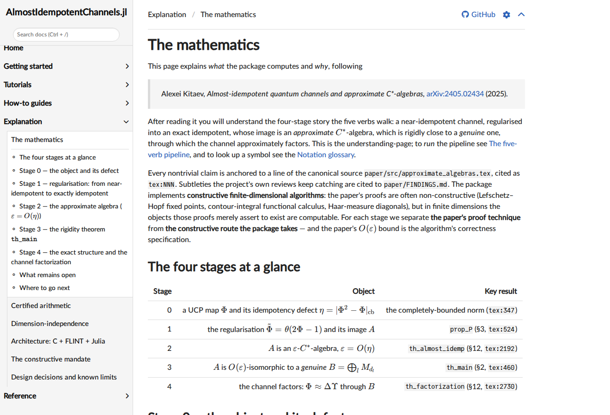

# `docs/` — what is in here

This directory holds the **documentation site** for `AlmostIdempotentChannels.jl`
plus a few internal developer artifacts. If you are looking for the
documentation, you want **[`src/index.md`](src/index.md)** — start there. Every
page is plain GitHub-navigable Markdown, so you can read the whole site here
without building anything.

<p align="center">
  
  <br/>
  <em>A content page of the rendered site (built with <code>make.jl</code>); the
  same text is readable as Markdown on GitHub.</em>
</p>

## The documentation (read this)

The user-facing docs are a [Documenter.jl](https://documenter.juliadocs.org) site,
authored as Markdown under [`src/`](src/) in a [Diátaxis](https://diataxis.fr)
structure. Browse it directly on GitHub starting at the home page; the links
between pages are relative and work here:

| Start at | What it is |
|---|---|
| **[`src/index.md`](src/index.md)** | Home — orientation, the five verbs, and "start here" routes |
| [`src/getting_started/`](src/getting_started/) | Installation and a five-minute quick start |
| [`src/tutorials/`](src/tutorials/) | Learning-oriented walkthroughs (the pipeline, the η = 0 oracle, …) |
| [`src/howto/`](src/howto/) | Task-oriented recipes (certify a defect, factorize a channel, …) |
| [`src/explanation/`](src/explanation/) | The mathematics, certified arithmetic, architecture, design |
| [`src/reference/`](src/reference/) | API reference, notation glossary, bibliography |

### Building the rendered HTML site (optional)

The Markdown is fully readable on GitHub. To build the rendered site with executed
code examples (every `@example`/`jldoctest` runs against `libaic` — see
[`../BUILDING.md`](../BUILDING.md) to build the C core first):

```sh
julia --project=docs -e 'using Pkg; Pkg.instantiate(); include("docs/make.jl")'
# output: docs/build/index.html  (open in a browser)
```

There is no hosted site and no CI deploy step by design; the site builds locally.

## Everything else in `docs/` (internal — not user documentation)

| Path | What it is | For |
|---|---|---|
| `make.jl`, `Project.toml`, `Manifest.toml` | the Documenter build script and its isolated Julia environment | building the site |
| `src/assets/` | images used by the site **and** the repository `README.md` (the canonical copy) | the site |
| `build/` | generated HTML output of `make.jl` (gitignored) | — |
| `plots/` | Julia scripts that regenerate the four result figures in `src/assets/` (CairoMakie) | maintainers |
| `research/` | **internal** design notes, specs, and research legs — one file per module/decision, bead-tracked. Not user documentation. | contributors |
| `adversarial/` | **internal** design catalog of the adversarial test corpus (the families of "evil" inputs the test suite is built around). The implementing test code lives in [`../tests/`](../tests/). | contributors |

If you are a contributor looking for design rationale, `research/` and
`adversarial/` are the developer notes; the canonical ground truth is the paper
source under [`../paper/`](../paper/) and the project laws in
[`../CLAUDE.md`](../CLAUDE.md).
