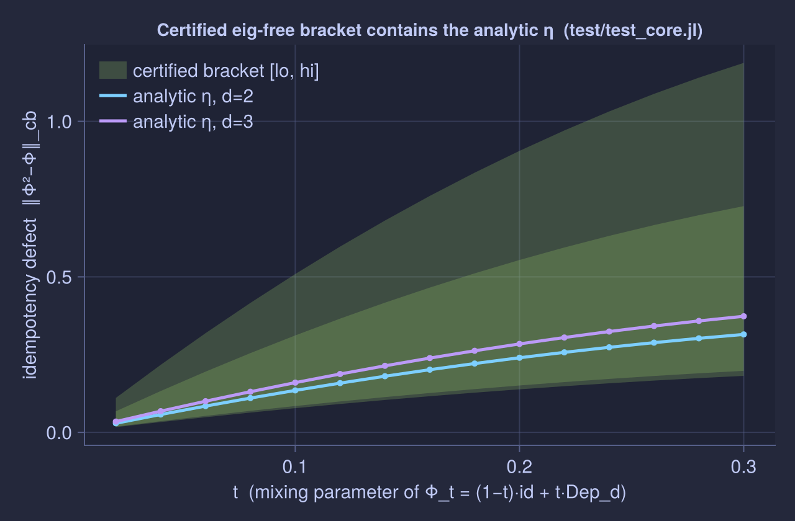

# Certified arithmetic

This page explains *why* the package's numbers are trustworthy: what a certified
bracket is, how it is built, and the four-rung cross-check ladder that the whole
test suite rests on. It is the understanding-page behind every scalar the verbs
return; to read a bracket in practice see [Interpret a CertifiedBracket](@ref).

The paper's entire subject is rigorous ``O(\varepsilon)`` bounds. A floating-point
computation that merely *looks* close is not a proof of a bound. So the package
certifies the bounds numerically rather than trusting `double`.

## A `CertifiedBracket` is a proof, not a guess

Every scalar result comes back as a [`CertifiedBracket`](@ref)

```math
\mathrm{lo} \le x \le \mathrm{hi},
```

where ``x`` is the true mathematical value (the idempotency defect, the associator
``\varepsilon``, an isomorphism cb-norm, a round-trip defect). The two endpoints
are computed in FLINT/arb interval arithmetic — each intermediate quantity is an
error *ball* (a midpoint with a rigorous radius), and every operation widens the
ball to enclose the true result. At the end the package rounds the ball **outward**
(`lo` toward ``-\infty`` with FLOOR, `hi` toward ``+\infty`` with CEIL) before
converting to `double`, so the inequality ``\mathrm{lo} \le x \le \mathrm{hi}``
survives the conversion. The bracket is therefore a *theorem about ``x``*: a proof
of exactly the kind of inequality the paper states.

This is why a defect being "zero" is checkable without ambiguity: on an
exactly-idempotent channel the bracket contains ``0`` and its endpoints sit at
machine ``\varepsilon`` — see [The η = 0 oracle](@ref).

## Where precision is load-bearing

Arbitrary precision is not decoration; it is required in three regimes where
`double` silently loses the answer:

1. **A tiny ``\varepsilon`` as a difference of ``O(1)`` quantities.** The defect
   ``(XY)Z - X(YZ)`` or ``\Phi^2 - \Phi`` is a small difference of two
   order-one operators; in `double` the leading digits cancel and what is left is
   rounding noise. In arb the cancellation is tracked and the residual ball is
   rigorous.
2. **Inverting a near-singular operator.** Several constructions invert operators
   whose smallest singular value is comparable to ``\varepsilon`` (for example the
   unitalisation ``(\Upsilon'(1))^{-1/2}`` of Stage 4). A `double` inverse there is
   unstable; the arb inverse carries a certified condition-aware ball.
3. **A spectral gap comparable to ``\varepsilon``.** The projection and
   block-structure steps resolve eigenvalue clusters; when a gap is the size of
   the defect, `double` cannot tell two clusters apart, and the certified path
   either resolves them with a proven gap or fails loud (it never guesses).

## How the solver-free bracket is built

The default route is **solver-free**: it certifies ``\eta = \|\Phi^2 -
\Phi\|_{\mathrm{cb}}`` without any semidefinite-programming solver. Let ``J`` be the
Choi matrix of the Hermiticity-preserving map ``\Lambda = \Phi^2 - \Phi`` — an
``n^2 \times n^2`` matrix, with ``n = \dim\mathcal{H}``. The Watrous
characterisation of the cb-norm gives the two-sided bound

```math
\frac{\|J\|_F}{n} \;\le\; \|\Lambda\|_{\mathrm{cb}} \;\le\; 2\,\|J\|_F ,
```

with ``\|J\|_F`` the Frobenius norm computed as an arb ball and rounded outward.
The upper bound follows from a Schur factorisation of the block-PSD constraint of
the cb-norm SDP; the lower bound from evaluating ``\Lambda`` on the
maximally-entangled state (`approximate_algebras.tex:347`). Both endpoints are
rigorous, so the result is a genuine bracket on ``\eta``. It is **loose by
design** — the ratio ``\mathrm{hi}/\mathrm{lo}`` is exactly ``2n`` — because it
*certifies* a value with a closed-form inequality rather than *competing* with a
solver for the exact number.

!!! note "The eig-free bracket is loose by design"
    The solver-free bracket has ``\mathrm{hi}/\mathrm{lo} \sim 2n``. It proves an
    inequality cheaply and with no solver; it does not try to be tight. For a tight
    bracket (width ``\sim 10^{-13}``) or the exact diamond-norm value, install the
    MOSEK extension — see [Tight brackets with MOSEK](@ref).

The **tight rung** feeds the same arb certifier the Watrous SDP feasible points
(the maximising primal for the lower bound, the minimising dual for the upper),
collapsing the width to roughly the solver tolerance plus the arb radius
(``\sim 10^{-13}``) while keeping the bracket rigorous. That rung requires MOSEK;
the default never does.

## The cross-check ladder — how the output is trusted

No single test certifies an algorithm. The suite stacks four independent checks,
weakest to strongest; each catches something the others cannot.

### Rung 1 — double versus arb at `prec = 53`

The same routine runs on both number paths: the fast `double`/LAPACK path and the
arb path at 53-bit precision. They must agree to ``\sim 10^{-10}``. This catches a
*coding* error (a wrong index, a transposed factor) because two independent
implementations would not share it. The C/arb Choi of ``\Phi^2 - \Phi`` matches the
pure-Julia one to within the round-trip threshold (`test_core.jl`).

### Rung 2 — certified containment of a closed form

For the family ``\Phi_t = (1-t)\,\mathrm{id} + t\,\mathrm{Dep}_d`` the defect has a
closed form ``\|\Phi_t^2 - \Phi_t\|_\diamond = t(1-t)\cdot 2(1 - 1/d^2)``. The
certified bracket must **contain** that analytic value for every ``t``. This
catches a *bound* error: a bracket that is too tight to be rigorous would exclude
the truth at some ``t``. Containment is a test invariant (`test_core.jl`).

```@raw html
<p align="center">
  
</p>
```

The shaded band is the eig-free certificate ``[\mathrm{lo}, \mathrm{hi}]``; the
line is the analytic ``\eta = t(1-t)\cdot 2(1 - 1/d^2)``. The band brackets the line
for every ``t`` — loose (``\mathrm{hi}/\mathrm{lo} \approx 2n``) but always
containing the truth (`test_core.jl`).

### Rung 3 — the ``\eta = 0`` oracle

When ``\Phi`` is *exactly* a conditional expectation, every defect must collapse to
zero. The measured maxima of the two factorization round-trip brackets are
``4.4\times10^{-75}`` and ``3.9\times10^{-75}`` at `prec = 128` — machine ``\varepsilon``,
not "small". This is the cleanest ground truth in the paper: zero defect is
unambiguous, and the extracted block structure is exactly right. Rung 3 catches a
*structural* error that rungs 1–2 can miss, because it pins the answer to an exact
value rather than a tolerance. It is the discipline test for every feature — see
[The η = 0 oracle](@ref).

### Rung 4 — strong duality (MOSEK)

With the MOSEK extension, the Watrous diamond-norm SDP is solved as both a primal
and a dual program; their values must agree (strong duality) and match the analytic
anchor. The measured maximum primal–dual gap is ``1.23\times10^{-11}``
(`test_sdp.jl`), which pins the dual normalisation and confirms the exact value the
tight bracket is built around. Rung 4 catches an error in the *exact* value path
that the loose bracket would not notice.

## What "fail loud" means here

When a precondition is violated — a channel outside the prop_P basin
``\rho(\Phi^2-\Phi) < 1/4``, a spectral gap too small to resolve, a contraction
constant ``\ge 1`` — the package aborts with a clear message at the call site rather
than returning a plausible-looking number. In the arb path, a ball that has lost all
precision is a loud failure, not a silently widened bound. Corrupted output is worse
than a crash; a certified bracket is only emitted when it is genuinely certified.

## Where to go next

- Read a bracket in practice: [Interpret a CertifiedBracket](@ref) and
  [Certify the idempotency defect (solver-free)](@ref).
- The exact-value path: [Tight brackets with MOSEK](@ref).
- The central dimension-free claim, with its own canary: [Dimension-independence](@ref).
- The software that makes the two number paths possible: [Architecture: C + FLINT + Julia](@ref).
