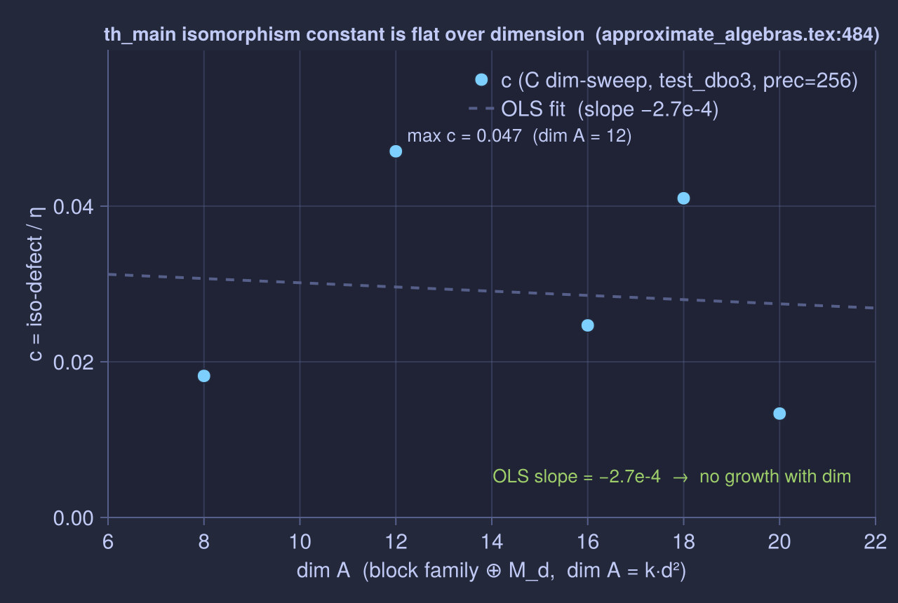

# Dimension-independence

This page explains the paper's central and most surprising claim — that the
rigidity constant of `th_main` does **not** grow with dimension — why the naive
construction fails to achieve it, and the measured evidence that the package's
construction does. For the theorem in context see [The mathematics](math_story.md); to read
the certified brackets it rests on see [Certified arithmetic](certified_arithmetic.md).

## The claim

`th_main` (`tex:460`) says any finite-dimensional ``\varepsilon``-``C^*``-algebra
``A`` is ``O(\varepsilon)``-isomorphic to a genuine ``C^*``-algebra ``B``, and:

> The implicit constant in ``O(\varepsilon)`` does not depend on ``A`` or its
> dimensionality. (`tex:460`)

Write the constant explicitly as ``c = (\text{isomorphism defect})/\varepsilon``.
The claim is that ``c`` is bounded by a **universal** number — the same for a
``2\times2`` algebra and for a ``1000``-dimensional one. This is what makes the
result a genuine rigidity statement rather than a fact that degrades as systems
grow.

## Why the naive route cannot achieve it

The natural way to fix approximate associativity is cohomological: the defect
``h(X,Y,Z) = (XY)Z - X(YZ)`` is a 3-cocycle, and if it were an exact coboundary
``h = \partial g`` the corrected product ``X\cdot Y = XY + g(X,Y)`` would be
``O(\varepsilon^2)``-associative; iterating would reach exact associativity
(`tex:478`). For an exact ``C^*``-algebra the trivialising **diagonal** is the Haar
average ``D = \int dU\,(U^\dagger\otimes U)`` (`tex:484`).

The trouble is quantitative (`tex:484`):

> naive constructions of the Haar measure (or just the diagonal) in the
> ``\varepsilon``-associative setting have error bounds proportional to
> ``n = \dim A``. So the outlined procedure works only if ``\varepsilon < c\,n^{-1}``.

That constant is ``\propto n`` — **dimension-dependent**, the opposite of what the
theorem asserts. The paper escapes this by proving the existence of the trivialising
structure with the Lefschetz–Hopf fixed-point theorem and improving the inclusion
with `cor_improvement` (`tex:1317`), whose reduced defect ``\delta_0 =
O(\varepsilon)`` is *independent of the starting ``\delta``* and of ``n``. The
package replaces those non-explicit ingredients with finite-dimensional
algorithms (see [The constructive mandate](constructive.md)) — but it must then *check* that the
constant it actually produces does not grow with ``n``.

## The test that cannot fail — and the one that can

This is the subtle part. A test that builds an ``\varepsilon``-``C^*``-algebra at one
fixed dimension and confirms an ``O(\varepsilon)``-isomorphism *exists* proves
nothing about dimension-independence: it would pass even if the constant grew like
``n``, because at fixed ``n`` the constant is just some finite number. The only
honest test is a **dimension sweep** that checks the constant stays bounded with no
upward trend as ``\dim A`` increases (`FINDINGS §D2`, `FINDINGS §C11`).

The package runs that sweep over a block-algebra family ``\bigoplus_j M_d`` whose
associated algebra has ``\dim A = k\,d^2``, growing ``\dim A`` while holding the
construction fixed. The predicate is an AND-gate that is *not* tunable to pass: the
absolute maximum ``c`` must be small **and** the ordinary-least-squares slope of
``c`` versus ``\dim A`` must be far below a proportional-growth slope calibrated
in-code. A within-family ratio ``c_{\max}/c_{\min}`` is deliberately *not* used — it
measures fixture-geometry spread, not dimension growth, and reads red on a geometry
outlier.

## The measured evidence

On the ``\bigoplus_j M_d`` family at `prec = 256` (`tests/test_dbo3.c`):

```
  dim A |  k |  d |  c = isodefect / η
  ------+----+----+---------------------
      8 |  2 |  2 |  0.0182
     12 |  3 |  2 |  0.0470     ← largest c, at a SMALL dimension
     16 |  4 |  2 |  0.0247
     18 |  2 |  3 |  0.0410
     20 |  5 |  2 |  0.0134

  OLS slope = -2.7e-4;   max c = 0.047 ≪ 1;   no growth with dim A.
```

The constant is flat — the slope is slightly *negative*, and the worst case
(``c = 0.047``) occurs at one of the *smallest* dimensions, not the largest. The
paper's dimension-independence claim (`tex:484`) holds empirically on this family.



The constant ``c = \text{isodefect}/\eta`` over ``\dim A \in \{8,12,16,18,20\}``:
OLS slope ``-2.7\times10^{-4}``, max ``c = 0.047`` at ``\dim A = 12``. The line is
flat; the naive route's would climb linearly (`tests/test_dbo3.c`, `prec = 256`).

The mutation discipline behind the plot is worth stating: the predicate was checked
against three independent growth models (a proportional ``p = 1`` model, a
single-spike model, and an independently re-derived ``0.001\cdot\dim`` model) and goes
red on each — so the green verdict is not an artifact of a lax threshold.

## What this is, and is not

The sweep is strong empirical evidence on a representative family; it is not a proof
of the universal constant. Two things remain open and are stated honestly elsewhere:
whether a dimension-independent spectral gap ``\Omega(1)`` always exists for
``\dim A > 1`` (`FINDINGS §D1`), and the explicit analytic value of the universal
constant ``c_0`` from `cor_improvement` (`FINDINGS §D2`). A constant that *did* grow
with dimension would not be a bug to patch — it would mean the naive
``n``-dependent route of `tex:484` had crept in, and it is escalated as a stop
condition, not tuned away.

## Where to go next

- The theorem in its four-stage context: [The mathematics](math_story.md).
- How the per-instance constants are certified: [Certified arithmetic](certified_arithmetic.md).
- The finite-dimensional algorithms behind the constant: [The constructive mandate](constructive.md).
